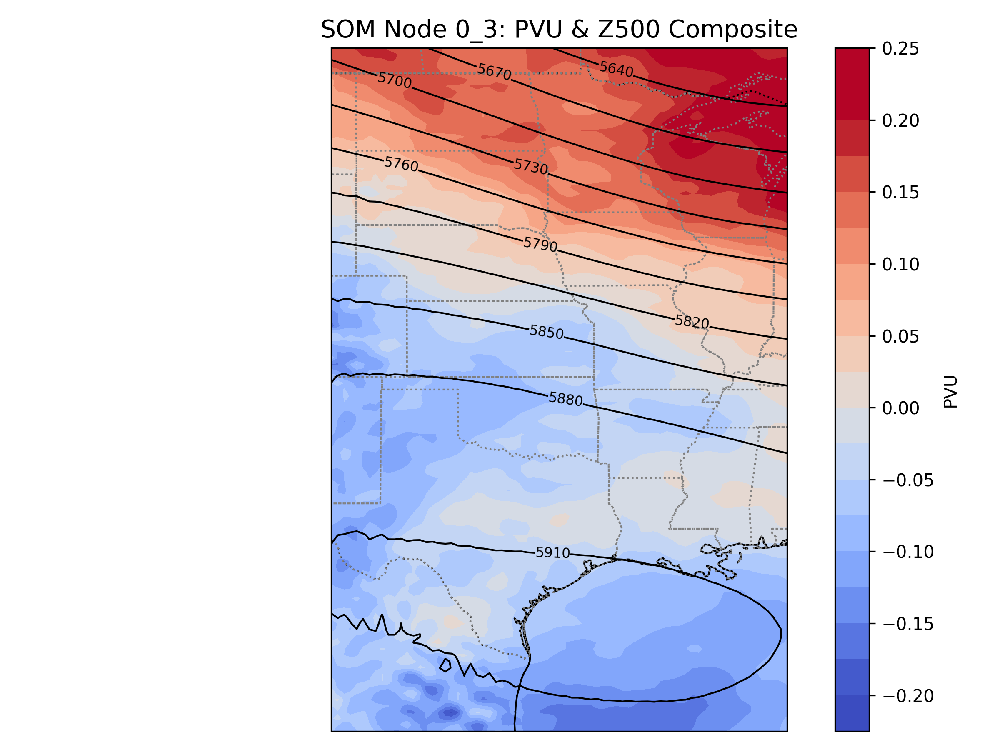
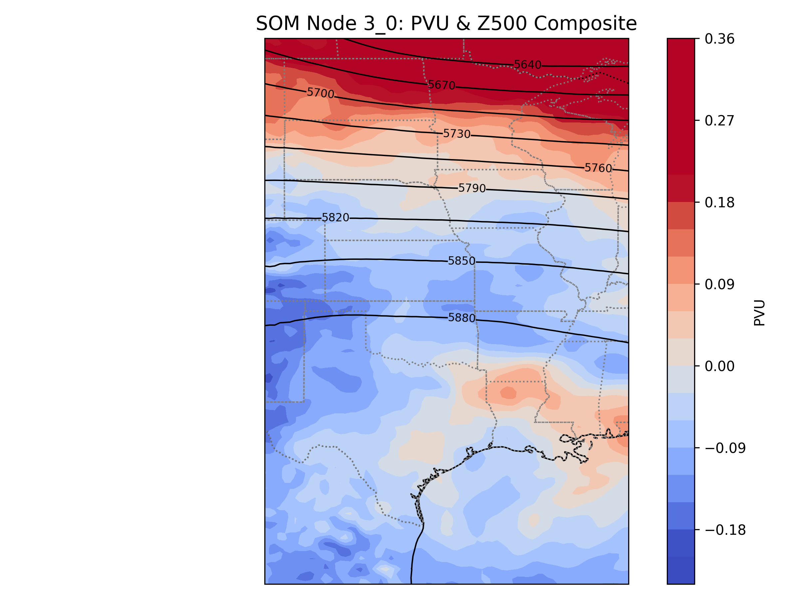
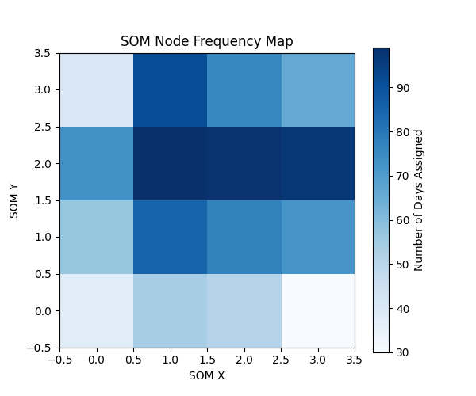

# Investigation of Blocking Patterns Using Self Organizing Maps (SOMs)

Authors: Anna Olsen and Emma Jilek

### Dependencies
You need to run this repository on a Google Colab environment. To run this repository, you will need the following dependencies: 
  - netcdf4
  - xarray
  - MiniSom
  - sklearn
  - jupyter
  - cartopy
  - pandas
  - scipy.ndimage
  - matplotlib.pyplot
  - cartopy.feature
  - google.colab
  - os
    
### Data 
To run this repository, you will need to download ERA5 netCDF data [OneDrive folder](https://niuits-my.sharepoint.com/personal/z2039321_students_niu_edu/_layouts/15/onedrive.aspx?CT=1746416775295&OR=OWA%2DNT%2DMail&CID=d655b501%2D47c3%2Dd4a4%2D4602%2D9cc6c3353b8c&e=5%3Ac528b26e02514f6ea31bc8d34741ad3c&sharingv2=true&fromShare=true&at=9&clickParams=eyJYLUFwcE5hbWUiOiJNaWNyb3NvZnQgT3V0bG9vayBXZWIgQXBwIiwiWC1BcHBWZXJzaW9uIjoiMjAyNTA0MTgwMDkuMDgiLCJPUyI6IldpbmRvd3MgMTEifQ%3D%3D&cidOR=Client&id=%2Fpersonal%2Fz2039321%5Fstudents%5Fniu%5Fedu%2FDocuments%2FJilek%5FOlsen%5FProject%5FDownload%5FData%5FEAE598%2FERA5%20for%20SOM&FolderCTID=0x0120003CF3B25D1D12AB418535C20767218ED4&view=0). You must use Google Colab to run the SOMs. Download the blocking_nodes.json file to view blocking nodes related to the following analysis, or run the models but the subsequent analysis may look different. 

**Optional**: Raw Net CDF4 data used to make 6 hr images of fields can be obtained from [OneDrive folder](https://niuits-my.sharepoint.com/personal/z2039321_students_niu_edu/_layouts/15/onedrive.aspx?id=%2Fpersonal%2Fz2039321%5Fstudents%5Fniu%5Fedu%2FDocuments%2FJilek%5FOlsen%5FProject%5FDownload%5FData%5FEAE598%2FERA5%20Updated%20Data&CT=1746416366869&OR=OWA%2DNT%2DMail&CID=89789cc9%2D2afa%2D8099%2D59fd%2D4caaca91e4da&e=5%3A766b2b5827d1491084c2826c178986fa&sharingv2=true&fromShare=true&at=9&FolderCTID=0x0120003CF3B25D1D12AB418535C20767218ED4&view=0](https://niuits-my.sharepoint.com/personal/z2039321_students_niu_edu/_layouts/15/onedrive.aspx?id=%2Fpersonal%2Fz2039321_students_niu_edu%2FDocuments%2FJilek_Olsen_Project_Download_Data_EAE598%2FERA5%20Updated%20Data&CT=1746416366869&OR=OWA-NT-Mail&CID=89789cc9-2afa-8099-59fd-4caaca91e4da&e=5%3A766b2b5827d1491084c2826c178986fa&sharingv2=true&fromShare=true&at=9&FolderCTID=0x0120003CF3B25D1D12AB418535C20767218ED4&view=0)). This can be used in the future to create a ground truth verification system for each labeled day.

## I. Introduction and Background

Atmospheric blocking refers to persistent, quasi-stationary high-pressure systems that disrupt the typical westerly flow in midlatitudes (Rex 1950). Dynamically, these blocking regimes have been found to alter the typical propagation of Rossby waves and can cause the upper-tropospheric flow to become stagnant (Lupo and Smith 1995; Nakamura and Huang 2018). These systems often bring static weather conditions for days to weeks, and can lead to severe heatwaves, droughts, and flooding in some regions during the summer months (Chan et al. 2019). Although atmospheric blocking patterns have a large influence on regional climate variability and extremes, the phenomenon is not well studied in the Central US region, and much of the Northern Hemisphere blocking research is focused on the North Atlantic and North Pacific sectors and the winter season.

In the Central U.S., blocking episodes are associated with strong mid-tropospheric anticyclonic flow that suppresses convection, reduces cloud cover through subsidence, and contributes to elevated surface temperatures and prolonged dry spells due to radiative forcing under the clear skies. Regions within our 23°–50°N and 105°–87°W domain are particularly vulnerable to the impacts of blocking events, especially during the warm season when soil moisture deficits and atmospheric feedbacks may act to amplify these heat extremes. This can have a significant impact on agriculture in the region (Woolings et al. 2018). Despite their high impact, the representation and predictability of blocks over the region remain challenging due to their nonlinear dynamics, sensitivity to upstream wave activity, and interaction with large-scale teleconnections like ENSO and the MJO (Henderson et al. 2016). These events are often broken up into three phases: onset, maintanance, and decay, and operational models currently struggle to handle the intensity and duration (i.e. the mantainance and decay phases) of atmospheric blocks (Lupo 2020).

Several potential vorticity (PV) gradient frameworks for diagnosing large-scale atmospheric flow and identifying coherent structures, such as blocking events, have been developed (Teubler & Riemer 2016; Hauser et al. 2023) PV combines vorticity and static stability into a scalar quantity that is conserved under adiabatic and frictionless conditions and has been determined to be useful for tracking the evolution of upper-level features such as cut-off lows and blocking highs (Teubler et al. 2023). Blocking events are often characterized by low-PV intrusions and strong PV gradients near the tropopause, which can result from Rossby wave breaking and lead to persistent anticyclonic circulation anomalies (Pelly and Hoskins 2003). Rather than using raw PV fields, our analysis uses the horizontal gradient magnitude of PV as a feature for blocking pattern clustering, which will show us spatial regions of sharp PV transitions associated with jet streaks, upper-level ridging, and barotropic instability (Hoskins & Woolings 2015).

Geopotential height at 500 hPa is often used as a diagnostic field to evaluate mid-tropospheric flow patterns and large-scale atmospheric circulations (Liu et al.2019, Tibaldi & Molteni 1990). Atmospheric blocking events, characterized by quasi-stationary high-pressure anomalies that disrupte the typical zonal flow, are typically identifiable by distinctive features in the 500-hPa geopotential height field, specifically with a weakened or reversed meridional and zonal height gradients (Rex 1950; Dole and Gordon 1983). During blocking events, the flow tends to flatten or become anticyclonically curved, producing regions of high heights and weak horizontal gradients in height, which is unlike progressive wave patterns, that show stronger height gradients associated with shortwave troughs and ridges (Wiedenmann et al. 2002, Pelly and Hoskins 2003). Specifically, reductions in the magnitude of horizontal geopotential height gradients at 500 hPa have been shown to correlate with blocking onset and persistence (Woollings et al. 2018).

In order to improve our understanding of the spatial and temporal structure of blocking in this region, we apply an unsupervised machine learning technique using self-organizing maps (SOMs), which allows us to develop a framework that is objective for classifying atmospheric patterns based on their similarity. Unlike supervised methods that require labeled output data, SOMs learn from the similarity among input vectors, and handle clustering, visualization, and pattern recognition quite well (Thomas et al. 2019). Recent work by Thomas et al. (2021)  used SOMs to develop a SOM-based blocking index (SOM-BI) to detect summer blocking events over Europe, and determined that the new index performed better when identifying blocked patterns compared to traditional indices. Their results highlight the potential for SOMs to detect persistent and more subtle features in the atmosphere which may be overlooked by the traditional indicies-- many of which use threshold-based methods. In this study, we use ERA5 reanalysis data and examine the 90-day June–July–August (JJA) periods for twelve anomalous summers (1940, 1954, 1956, 1980, 2002, 2003, 2006, 2007, 2011, 2012, 2020, and 2023) to identify and cluster blocking-like circulation features. By testing several SOM configurations and evaluating their performance, we aim to document the dominant blocking regimes and assess their frequency, structure, and potential relationship to regional drought and heatwave events.

To complement the self-organizing maps (SOM) analysis, we apply K-Means clustering as a secondary classification tool to group SOM nodes into broader atmospheric regimes. K-Means is a widely used unsupervised machine learning algorithm that partitions data into aa specified number of clusters (_k_) based on feature similarity. Unlike SOMs, which impose a topological 2D structure to organize patterns, K-Means directly identifies centroids in the feature space and assigns each data point to the nearest cluster center. This allows for an object separation of SOM nodes into dynamically coherent regimes based on weight vectors. In the context of this study, K-Means clustering was applied after SOMs ran. K-Means clustering was applied to the flattened weight vectors of each SOM node. This allowed us to improve interpretability of blocking and non-blocking events. This approach, where K-Means is applied after SOM evaluation, draws from the methodology used in similar meteorological applications (Horton et al 2015; Thomas et al. 2021) and enhances interpretability by linking fine-scale SOM classification to atmospheric blocking regimes. 


## II. Data and Methods - Self Organizing Maps

### Data Sourcing and Preprocessing
Our data for this project was obtained from the European Center for Medium-Range Weather Forecasts Reanalysis Version 5 (ERA5), which provides global atmospheric fields at a 0.25° × 0.25° horizontal resolution. The dataset is in NetCDF format and was processed using xarray and netCDF4 Python libraries. We utilized 6-hourly ERA5 data for the variables of 500 hPa geopotential height (z) and potential vorticity (PV) at 500 hPa, as these fields are frequently used in the identification and analysis of atmospheric blocking patterns (Pelly and Hoskins 2003). A daily mean was calculated for each value to focus on the broader synoptic pattern, reduce the redundancy of having consecutive time steps that are often highly correlated, and smooth the clustering pattern to better reflect large-scale flow patterns. Our spatial domain covers the Central US, bounded between 23°N–50°N latitude and 105°W–87°W longitude. The data was extracted from the original dataset with latitude and longitude ranges corresponding to this region.


> Figure 1. Project spatial domain for Central US (23°N–50°N latitude and 105°W–87°W longitude).
>
> The code and methodology follows similar methodology to Kurtz 2021, which used Minisoms for using 2D atmospheric data and generating SOMs. This provided me a guidance to the workflow and requirements of preprocessing atmospheric data to prepare it for machine learning. 

Our analysis focused on JJA periods for twelve years with known anomalous summer drought conditions: 1940, 1954, 1956, 1980, 2002, 2003, 2006, 2007, 2011, 2012, 2020, and 2023. These years were selected based on drought indices to serve as case studies for the evaluation of blocking event frequency and structure. Data preprocessing included temporal subsetting, spatial regridding, calculation of geopotential height and PVU gradient fields,and z-score normalization to prepare them for SOM training.  The input fields were processed using Python libraries, including Xarray, Numpy, Pandas, MiniSom, Sklearn, Scipy, Matplotlib, and Cartopy, and then reshaped into 2D arrays so each field represented a spatial pattern across the spatial domain. 

Spatial gradients of Z500 and PV were computed to capture the strength of horizontal flow patterns. Gradients were derived using central differences with latitude/longitude converted to metric distances (i.e. PVU/m and m/m). The gradient magnitudes were then averaged over our spatial domain for each timestep to create a time series of domain-mean gradients for both fields.

### Feature Engineering and Data Normalization
Two key features were selected to represent blocking, as seen in literature introduced above on the subject:

1. Z500 gradient (mean): weak geopotential height gradients suggest high-pressure/ridging. Horizontal gradients of 500 hPa geopotential height were computed using a centered finite differencing method. Total magnitude of gradient was spatially averaged over domain to get a scalar value of Z500 gradient per time step.
2. PV gradient (mean): lower gradients are associated with Rossby wave breaking and weak PV advection, indicative of blocked flow. Using the same method as done for Z500 gradient, PV values were converted to potential vorticity units (PVU), and gradients were computed in both meridional and zonal directions. The gradient magnitude was calculated and averaged over the domain.

This methodology allowed us to create a time series of domain-mean gradients for both PVU and Z500. Features were stacked into 2D arrays of (time x variables). The variables were standardized using the scikit-learn StandardScaler function to transform variables into z-scores to ensure equal weighting with zero mean and unit variance before being input into the model for training.

### Self Organizing Map (SOM) Configuration
A Self-Organizing Map (SOM) was used to classify synoptic-scale patterns based on the two standardized features discussed above. We used the Python package Minisom to create the SOMs. We tested multiple configurations, which included changing the grid sizes, varying the neighborhood radius (sigma), and adjusting the learning rates of each model. The SOM configuration with the lowest quantization error (QE) and topographic error (TE) was selected for further analysis:


The SOM model had dimensions 4x4, a sigma of 1.0, and a learning rate of 0.05. With each run of the SOM model testing loop, this model configuration consistently performed the best, so it will be used in subsequent testing. Each day was mapped to a Best Matching Unit (BMU) or SOM node, which allows us to do pattern classification across the dataset. Table 1 shows the configurations for each model that was trained.


> Tablel 1. SOM model configurations tested with QE and TE values. SOM model winner highlighted.

### Blocking Classification Method
Blocking scores were calculated by combining the negative standardized PV gradient and Z500 gradient:

**Blocking Score** = - (Standardized PV Gradient Mean) - (Standardized Z500 Gradient Mean)

The formula assumes that lower gradient magnitudes in both variables are associated with atmospheric blocking. SOM nodes in the top 20th percentile (>80% of the data) of the blocking score distribution were flagged as a blocking-like pattern. The 80% threshold was selected arbitrarily and may be refined in the future to better classify these events. 

Each day in the dataset was labeled as "blocked" (1) if its BMU belonged to one of the identified blocking nodes and "not blocked" if (0) if the node was not identified as belonging to a "blocked" node. Table 2 shows the count of days for each node, as well as the blocked/not blocked labeling of each node.


> Table 2. The mean gradient of PV and Z500 for each SOM node with blocked classification labels.

### Composite Analysis and Other Visualizations
To visualize and interpret possible blocking patterns, composite maps of 500 hPa geopotential height and PVU were generated for each SOM node.  These maps were constructed by averaging the original, raw spatial fields for all days associated with each node. Additionally, plots for the gradients of both fields were plotted using the feature-engineered data for assessment. The visualizations were created using matplotlib and cartopy Python packages. Final outputs were exported as .png images for each SOM node and used to assess the synoptic characteristics of blocking regimes and establish a ground truth for the outputted data in future research.


## II. Data and Methods - Kmeans Clustering

In the first stage, we used domain-averaged ERA5 reanalysis features, specifically the horizontal gradients of 500 hPa geopotential height (Z500) and PV. The data covered the summer months of JJA with the twelve years stated over the same spatial domain. For ech day, we computed the magnitude of the horizontal gradient for both variables, then averaged these values over the domain to create a time series domain-mean Z500 and PV gradients. 

To group similar SOM nodes into broader atmospheric flow regimes, K-Means clustering was applied to the trained SOM node weight vectors. This post-processing step aimed to classify SOM-identified patterns into higher-order synoptic regimes and objectively isolate blocking-like events. 

### Input Feature Preparation 
The SOM consisted of a 4 x 4 grid, yielding 16 nodes. Each node had an associated weight vector representing the average standardized values of the domain averaged 500 hPa geopotential height gradient and potential vorticity gradient. These two features captured upper-tropospheric flow structure and dynamical sharpness.  

### K-Means Clustering Procedure 
K-Means clustering was utilized with the clusters ranging from _k_ =4 to 8. Before clustering, the 16 node weight vectors were re-standardized to ensure equal feature scaling. The goal was to group SOM nodes into a manageable number of dynamically similar regimes. Each cluster label was then mapped back to the SOM grid, allowing spatial visualization of regime patterns across the 4 x 4 topology. This enabled interpretation of whether adjacent nodes were also grouped into consistent higher-level flow regimes.  

### Dimensionality Reduction for Visualization 
To visually confirm the optimal number of K-Means clusters, different tests were involved:

1. Silhouette Score: Measures how similar a node is to its own cluster versus others. Scores near 0.5 or higher indicate good separation and cohesion. 
2. Davies-Bouldin Index (DBI): Captures average similarity between clusters; lower values signify better compactness and distinctiveness. 
3.Calinski-Harabasz Score (CH): Quantifies the ratio of between-cluster to within-cluster dispersion; higher scores reflect well-separated clusters. 

Additionally, to visualize the cluster structure, t-distributed Stochastic Neighbor Embedding (t-SNE) was applied to the SOM node weight matrix. This 2D projection revealed the necessary nodes associated with blocking events and which did not. 


## III. Results - Self Organizing Maps

### Composite Patterns for Each Node
The following figures show the composite patterns for each SOM node that was labeled as "blocked", which include the spatial distribution of potential vorticity (PVU, shaded) and 500 hPa geopotential height (Z500, contoured). These include:


> Figure 3. Composite anomalies in PV and Z500 for "blocked" node 1_3.
> 
> Figure 4. Composite anomalies in PV and Z500 for "blocked" node 2_3.
> 
> Figure 5. Composite anomalies in PV and Z500 for "blocked" node 3_3.
>
> These SOM nodes were flagged as blocking-related based on being in the upper 20th percentile of blocking scores derived from the combined PV and Z500 gradient features. Each composite reveals a distinct but consistent blocking signature in the Central U.S. region.
> 1. Node 1_3 (Figure 3) displays a broad anticyclonic ridge centered over Texas and the southern Plains, with high 500-hPa geopotential heights enear 5900 m. The geopotential height contours are widely spaced, indicating a weakened horizontal gradient, a classic marker of atmospheric blocking. The PVU anomalies show a widespread negative PV anomaly across the southern half of the domain.
> 2. Node 2_3 (Figure 4) shows an amplified ridging pattern, with a closed geopotential height contour (~5890 m) centered over Texas, indicating a cutoff high, and is surrounded by weak negative PV anomalies
> 3. Node 3_3 (Figure 5) shows broad ridging over the southern and central Plains, with height values near 5890 m. The PV field is marked by weak gradients and widespread positive anomalies, particularly in the mid-Mississippi Valley.

The following figures show the composite patterns for each SOM node that was labeled as "not blocked", which include the spatial distribution of potential vorticity (PVU, shaded) and 500 hPa geopotential height (Z500, contoured).


> Figure 6. Composite anomalies in PV and Z500 for "not blocked" node 0_0.
> 
> Figure 7. Composite anomalies in PV and Z500 for "not blocked" node 0_1.
> 
> Figure 8. Composite anomalies in PV and Z500 for "not blocked" node 0_2.
> 
> Figure 9. Composite anomalies in PV and Z500 for "not blocked" node 0_3.
> 
> Figure 10. Composite anomalies in PV and Z500 for "not blocked" node 1_0.
> 
> Figure 11. Composite anomalies in PV and Z500 for "not blocked" node 1_1.
> 
> Figure 12. Composite anomalies in PV and Z500 for "not blocked" node 1_2.
> 
> Figure 13. Composite anomalies in PV and Z500 for "not blocked" node 2_0.
> 
> Figure 14. Composite anomalies in PV and Z500 for "not blocked" node 2_1.
> 
> Figure 15. Composite anomalies in PV and Z500 for "not blocked" node 2_2.
> 
> Figure 16. Composite anomalies in PV and Z500 for "not blocked" node 3_0.
> 
> Figure 17. Composite anomalies in PV and Z500 for "not blocked" node 3_1.
> 
> Figure 18. Composite anomalies in PV and Z500 for "not blocked" node 3_2.
>
The figures 6-18 above show interesting patterns that are mostly distinct from the blocked patterns flagged by the threshold, with many of them showing more zonal flow and positive PV anomalies compared to the blocked pattern nodes.

### "Blocking" Frequency Across Years
The annual number of blocked days during JJA for each composite year is shown in Figure 19. Blocking frequency varied substantially from year to year, with 1940 experiencing the highest number of days flagged by our method as "blocked" (32 days), followed by several years with a moderate amount of days listed as "blocking" (i.e. 1954, 2002, and 2003). In contrast, more recent years such as 2023, 2012, and 2011 showed very few blocked days. This temporal variability suggests potential modulation by large-scale climate drivers or other modes of variability.


> Figure 19. Number of days labeled as "blocked" by year.

### Seasonal "Blocking" Patterns
A monthly breakdown of blocking by year is shown in Figure 20. Several key patterns emerge:
1. July consistently shows the highest number of blocked days in years like 1940, 2002, and 2007.
2. August had the most blocked days in 1940 and 1956.
3. June typically saw fewer blocked days overall.


> Figure 20. Heatmap of days labeled as "blocked" by year and month.

The heatmap tells us that blocking is not evenly distributed within the summer season, and that July tends to be more favorable for blocking in the Central U.S.

### Blocking Score Thresholding
The distribution of SOM node blocking scores is shown in Figure 21. SOM nodes with higher blocking scores represent patterns associated with reduced PV and Z500 gradients, which may be indicative of high-pressure anomalies related to blocking. The red dashed line denotes the 80th percentile threshold (value = 1.26), above which nodes were flagged as blocking-related. This approach allowed us to create an objective criterion that may isolate blocking regimes created by the SOM model.


> Figure 21. Distribution of SOM nodes by blocking score with 80% threshold line (red).

### SOM Node Temopral Assignments
The temporal assignment of SOM nodes by year is depicted in Figure 22. Each grid cell shows how many days in a given year were classified into each SOM node. The red vertical lines highlight nodes identified as blocking-related. Several years, in particular 1940, 1980, and 2002, had a substantial number of days assigned to blocking nodes, and this aligns with the results of our bar chart in Figure ___ (frequencies across year).


> Figure 22. SOM node frequency map with number of days assigned per node.
> 
### Node Frequency and Dominant Patterns
Figures 23 and 24 summarize the overall SOM node activity, where:
1. Figure 23 shows the total frequency of each node across the dataset. Nodes 2_3 and 2_1 were most commonly assigned by the SOM model, indicating frequently occurring atmospheric flow patterns.
2. Figure 24, a 2D heatmap of the SOM grid, shows us that the central SOM nodes were most dominant in the classification scheme, while corner nodes (especially 0_0 and 3_3) were less frequently used. This tells us that the SOM is able to represent both common and rare patterns in anomalously dry years.


> Figure 23. Frequency of SOM nodes classified in dataset.
> 
> 
> Figure 24. Number of SOM nodes assigned by year with blocking nodes boxed in red.
> 
### U-Matrix and Node Separation
To assess pattern distinctiveness and topological relationships, a Unified Distance Matrix (U-Matrix) was computed (Figure 25). The darker areas show us where there are greater distances between adjacent node weight vectors, which indicates more distinct pattern transitions. The red squares identify the blocking nodes. These blocked nodes are at or near higher U-matrix distances, which may suggest that they represent synoptic patterns separate from more common zonal patterns, such as those shown in figure ___ (node frequency).


> Figure 25. SOM Model U-Martix node. with blocking label as red box over node.
> 
## III. Results - Kmeans Clustering
To explore the separability of atmospheric blocking regimes, we performed K-Means clustering after the application of SOMs. These experiments assessed the ability of K-Means to objectively group summer days and SOM nodes based on PV and Z500 characteristics. 

Following the training on the 4 x 4 SOM on daily summer ERA5 data, K-Means clustering was applied to the SOM node weight vectors to further condense the 16 learned nodes into a broader atmospheric flow regime. Each node’s weight vector consisted of two standardized features: the domain-averaged 500 hPa geopotential height (Z500) gradient and potential vorticity (PV) gradient. The objective was to access whether similar SOM nodes could be grouped into coherent, physically interpretable clusters and whether blocking-prone nodes would be classified together. 

### Cluster Identification and Evaluation 

Each of the 16 SOM node vectors was clustered using K-Means for values of _k_ ranging from 2 to 8. Internal validation metrics were computed for each configuration:  

Silhouette Score, as shown in Figure 26, peaked at 0.53 for _k_, indicating a strong cluster separation and cohesion. 


> Figure 26. Silhouette score for values of K ranging from 2-8.
> 
To visualize and validate the structure of the resulting clusters, we applied t-distributed Stochastic Neighbor Embedding (t-SNE) to the SOM node weights. The resulting 2D projections revealed clear and well-separated clusters, with each of the four K-Means groups forming distinct, compact groupings. Importantly, blocking prone nodes (1_3, 2_3, 3_3) appeared within a tight, isolated cluster in the t-SNE space, reinforcing their dynamic similarity and the effectiveness of the SOM and K-Means approach for identifying such regimes.  

### SOM Node Assignments and Blocking Characteristics 
To visualize and validate the structure of the resulting clusters, we applied t-distributed Stochastic Neighbor Embedding (t-SNE) in Figure 27 to the SOM node weights. The resulting 2D projections revealed clear and well-separated clusters, with each of the four K-Means groups forming distinct, compact groupings. Importantly, blocking prone nodes (1_3, 2_3, 3_3) appeared within a tight, isolated cluster in the t-SNE space, reinforcing their dynamic similarity and the effectiveness of the SOM and K-Means approach for identifying such regimes.  
The K-Means cluster assignments were projected back onto the SOM grid, showing that spatially adjacent nodes were often grouped into the same cluster, despite K-Means being agnostic to grid structure.


> Figure 27. T-distributed Stochastic Neighbor Embedding (t-SNE) applied to SOM node weights.

The nodes grouped in Cluster 2 and Cluster 3 exhibited defining characteristics of blocking conditions, including strongly negative Z500 gradients and low to strongly negative PV gradients For instance, as shown in Table 2: 
Node 1_3: PV gradient = -1.42, Z500 gradient = 0.29 
Node 2_3: PV gradient = -1.29, Z500 gradient = -0.98 
Node 3_3: PV gradient = -0.24, Z500 gradient = -1.62 

Figure 27 shows that the nodes formed the core of the blocking regime and clustered together consistently both in SOM and t-SNE space. 

K-Means clustering applied to SOM node weight vectors successfully reduced 16 learned SOM patterns into four objectively defined flow regimes. Cluster 2, in particular, captures the core of blocking nodes, which were characterized by suppressed PV and Z500 gradients, rare occurrences, and tight grouping in t-SNE projection space. The strong internal clustering metrics, combined with the interpretability of the cluster structure across both SOM and t-SNE visualizations, demonstrate the robustness of this hybrid SOM and K-Means approach for identifying summer atmospheric blocking regimes in the Central United States.

## IV. Discussion

This project used Self-Organizing Maps (SOMs) and K-Means clustering to objectively identify and classify atmospheric blocking patterns over the Central United States during anomalously dry summers. By utilizing domain-averaged gradients of 500 hPa geopotential height (Z500) and potential vorticity (PV), we aimed to capture the dynamical signatures likely associated with blocking events. The SOM effectively clustered daily atmospheric patterns into distinct nodes, which appears to contain characteristics indicative of blocking, such as weakened Z500 and PV gradients. Subsequent K-Means clustering grouped these nodes into broader regimes, enhancing the interpretability of the results.

Several limitations must be considered when applying this methodology. The reliance on domain-averaged gradients may underepresent the true blocking dynamics. Additionally, the selection of the 80th percentile threshold for defining blocking nodes was chosen somewhat arbitrarily and may influence the classification outcomes. With a smaller threshold (top 10%), you would get less SOM nodes labeled as blocked, which would change the results. The use of only two features (Z500 and PV gradients) may not fully address the complex and non-linear dynamics of atmospheric blocking, which can be influenced by other factors.

The study focused exclusively on the Central U.S. during summer months, limiting the generalizability of the findings to other regions and seasons. The application of SOMs and K-Means clustering, while effective for pattern recognition, does not always account for the temporal persistence of blocking events, which is a defining feature of the phenomenon. Future research could address these limitations by incorporating additional variables to capture a more comprehensive picture of blocking dynamics that were not addressed in this project. The project could also benefit from expanding the scope fo the spatial and temporal analysis for the methodology to be applied in similar situation.

## V. Conclusion 

This study demonstrated the utility of Self-Organizing Maps (SOMs) and K-Means clustering as objective tools for identifying and classifying atmospheric blocking events over the Central United States during the summer season. By using domain-averaged gradients of 500 hPa geopotential height and potential vorticity—two physically grounded indicators of mid-tropospheric flow regime changes—we were able to effectively cluster daily atmospheric states and isolate blocking-like patterns based on their dynamical signatures. The SOM model successfully distinguished between blocked and non-blocked flow patterns, with blocking nodes showing suppressed PV and Z500 gradients consistent with the literature on blocking dynamics. The addition of K-Means clustering further improved the interpretability by grouping similar SOM nodes into similar regimes. Visual composites of PV and Z500 confirmed the physical plausibility of the blocked patterns as identified by the model, which featured anticyclonic ridging and weak flow gradients often linked to persistent heat and drought. While the method offers a framework for classifying blocking events, several limitations remain, such as those that were discussed above, include the subjective thresholding of blocking scores, the omission of additional atmospheric variables, and the lack of a persistence criteria. Despite these challenges, the approach highlights the potential of unsupervised learning in atmospheric pattern detection and provides a possible alternative to traditional blocking indices. Overall, this work contributes to our understanding of summer blocking in a region that has historically been understudied in this context. We hope the research will help in future applications to climate and weather model evaluation, and possibly extreme event science and attribution studies.


## VI. References

Baldé, B., 2023: Self-Organizing Maps Explained. Medium. https://medium.com/@becaye-balde/self-organizing-maps-explained-9bb88b9a620a

Cervantes, A., 2023: Interpreting and validating clustering results with K-Means. Medium. https://medium.com/@a.cervantes2012/interpreting-and-validating-clustering-results-with-k-means-e98227183a4d

Chan, P. W., P. Hassanzadeh, and Z. Kuang, 2019: Evaluating indices of blocking anticyclones in terms of their linear relations with surface hot extremes. Geophysical Research Letters, 46, 4934–4943, https://doi.org/10.1029/2019GL083307.

Davini, P., C. Cagnazzo, S. Gualdi, and A. Navarra, 2012: Bidimensional diagnostics, variability, and trends of Northern Hemisphere blocking. Journal of Climate, 25, 6496–6509, https://doi.org/10.1175/JCLI-D-12-00032.1

Hauser, S., F. Teubler, M. Riemer, P. Knippertz, and C. M. Grams, 2023: Towards a holistic understanding of blocked regime dynamics through a combination of complementary diagnostic perspectives. Weather and Climate Dynamics, 4, 399–425, https://doi.org/10.5194/wcd-4-399-2023

Hauser, S., F. Teubler, M. Riemer, P. Knippertz, and C. M. Grams, 2024: Life cycle dynamics of Greenland blocking from a potential vorticity perspective. Weather and Climate Dynamics, 5, 633–658, https://doi.org/10.5194/wcd-5-633-2024

Henderson, S. A., E. D. Maloney, and E. A. Barnes, 2016: The influence of the Madden–Julian Oscillation on Northern Hemisphere winter blocking. Journal of Climate, 29, 4597–4616, https://doi.org/10.1175/JCLI-D-15-0502.1

Hoskins, B., and T. Woollings, 2015: Persistent extratropical regimes and climate extremes. Current Climate Change Reports, 1, 115–124, https://doi.org/10.1007/s40641-015-0020-8

Ichsana, D. W., 2023: Meteorology 101: How to download and plot meteorological data from ERA5. Medium. https://dwikita-ichsana.medium.com/meteorology-101-how-to-download-and-plot-meteorological-data-from-era5-dcbf12553d6a 

Kohonen, T., 1990: The self-organizing map. Proc. IEEE, 78, 1464–1480, https://doi.org/10.1109/5.58325

Kurtz, T., 2021: MiniSOM Tutorial for 2-D Atmospheric Data and Example Using Mean Sea Level Pressure Data. GitHub repository. Available at: https://github.com/taliakurtz/MiniSOM_tutorial/tree/main

Luo, D., W. Zhang, L. Zhong, and A. Dai, 2019: A nonlinear theory of atmospheric blocking: A potential vorticity gradient view. Journal of the Atmospheric Sciences, 76, 2399–2427, https://doi.org/10.1175/JAS-D-18-0324.1

Lupo, A. R., and P. J. Smith, 1995: Climatological features of blocking anticyclones in the Northern Hemisphere. Tellus A: Dynamic Meteorology and Oceanography, 47, 439–456, https://doi.org/10.1034/j.1600-0870.1995.t01-3-00004.x

Martin, T., 2021: MiniSomTutorial_Atmo. GitHub repository. Available at: https://github.com/ThomasMGeo/MinisomTutorial_Atmo/tree/main

Mukesh, C., 2023: Silhouette analysis in K-means clustering. Medium. https://medium.com/@cmukesh8688/silhouette-analysis-in-k-means-clustering-cefa9a7ad111 

Nanda, A., 2024: Self-Organizing Maps: An Intuitive Guide with Python Examples. DataCamp, https://www.datacamp.com/tutorial/self-organizing-maps

Nicodem, B., 2023: Classification of unlabelled images using KMeans + Transfer Learning (CNN). Medium. https://medium.com/@BriceNicodem/classification-of-unlabelled-images-using-kmeans-transfer-learning-cnn-9ce292f325b7 

Nakamura, N., and C. S. Y. Huang, 2018: Atmospheric blocking as a traffic jam in the jet stream. Science, 361, 42–47, https://doi.org/10.1126/science.aat0721

Pelly, J. L., and B. J. Hoskins, 2003: A new perspective on blocking. Journal of the Atmospheric Sciences, 60, 743–755, https://doi.org/10.1175/1520-0469(2003)060<0743:ANPOB>2.0.CO;2

Pinheiro, M. C., P. A. Ullrich, and R. Grotjahn, 2019: Atmospheric blocking and intercomparison of objective detection methods: Flow field characteristics. Climate Dynamics, 53, 4189–4216, https://doi.org/10.1007/s00382-019-04782-5

Robu, R., 2023: Clustering text data with K-Means and visualizing with t-SNE. Medium. https://medium.com/@RobuRishabh/clustering-text-data-with-k-means-and-visualizing-with-t-sne-9bc1fe7d8fed

Rex, D. F., 1950: Blocking action in the middle troposphere and its effect upon regional climate. Tellus, 2, 275–301, https://doi.org/10.1111/j.2153-3490.1950.tb00339.x

Riemer, M., F. Teubler, V. Wirth, C. Polster, S. Hauser, and C. M. Grams, 2023: Dynamics of blocked weather regimes in the North Atlantic-European region: similarities and variability. Presented at the XXVIII General Assembly of the International Union of Geodesy and Geophysics (IUGG), Berlin, Germany, https://doi.org/10.57757/IUGG23-4158

Scikit-learn developers, 2025: StandardScaler. scikit-learn 1.6.1 Documentation, https://scikit-learn.org/stable/modules/generated/sklearn.preprocessing.StandardScaler.html

Teubler, F., and M. Riemer, 2016: Dynamics of Rossby wave packets in a quantitative potential vorticity–potential temperature framework. Journal of the Atmospheric Sciences, 73, 1063–1081, https://doi.org/10.1175/JAS-D-15-0162.1

Teubler, F., M. Riemer, C. Polster, C. M. Grams, S. Hauser, and V. Wirth, 2023: Similarity and variability of blocked weather-regime dynamics in the Atlantic–European region. Weather and Climate Dynamics, 4, 265–285, https://doi.org/10.5194/wcd-4-265-2023

Thomas, C., A. Voulgarakis, G. Lim, J. Haigh, and P. Nowack, 2021: An unsupervised learning approach to identifying blocking events: the case of European summer. Weather and Climate Dynamics, 2, 581–608, https://doi.org/10.5194/wcd-2-581-2021

Tibaldi, S., and F. Molteni, 1990: On the operational predictability of blocking. Tellus A: Dynamic Meteorology and Oceanography, 42, 343–365, https://doi.org/10.3402/tellusa.v42i3.11882

Vettigli, G., 2018: MiniSom: minimalistic and NumPy-based implementation of the Self Organizing Map. GitHub. https://github.com/JustGlowing/minisom

Wiedenmann, J. M., A. R. Lupo, I. I. Mokhov, and E. A. Tikhonova, 2002: The climatology of blocking anticyclones for the Northern and Southern Hemisphere: Block intensity as a diagnostic. Journal of Climate, 15, 3459–3473, https://doi.org/10.1175/1520-0442(2002)015<3459:TCOBAF>2.0.CO;2

Woollings, T., D. Barriopedro, J. Methven, S.-W. Son, O. Martius, B. Harvey, J. Sillmann, A. R. Lupo, and S. Seneviratne, 2018: Blocking and its response to climate change. Current Climate Change Reports, 4, 287–300, https://doi.org/10.1007/s40641-018-0108-z


# Requirements Document

All unit tests for SOM and kmeans models will be tested at the end of the SOM_kmeans_blocking.ipynb.

We identified the following requirements for this project:

| JET01-01  | Load ERA5 Dataset 
|---------|------------| 
| Priority | High |
| Sprint | 1 |
| Assigned To | Emma |
| User Story   | As developers, we need load data from NetCDF4 files to analyze ane preprocess necessary fields. |                                                                                                                                       | 
| Requirements | |
| | 1. Must load 500 hPa PV and Z500 data with correct units using Xarray.|
| | 2. Must load 500 hPa PV and Z500 data with correct months using Xarray.|
| | 3. Must load 500 hPa PV and Z500 data with the correct years using Xarray.|
| Acceptance Criteria | |
| | 1. Dataset opens without error using xarray.|
| | 2. Required variables z, pv are in dataset with expected shapes.|
| | 3. Dimensions include valid_time, latitude, longitude. |
| | 4. Pressure level for both variables = 500 hPa. |
| Unit Test | | 
```
"""Check if dataset is opened correctly as an xarray.Dataset."""
def test_dataset_opens():
    assert isinstance(ds, xr.Dataset)

"""Check that required variables 'pv' and 'z' are present in dataset."""
def test_variable_presence():
    assert 'pv' in ds.data_vars and 'z' in ds.data_vars

"""Verify that dataset includes the required coordinates."""
def test_coordinate_dimensions():
    for coord in ['valid_time', 'latitude', 'longitude']:
        assert coord in ds.coords

"""Check that the pressure level is 500 hPa."""
def test_pressure_level_value():
    assert ds.pressure_level.values[0] == 500.0
```


| JET02-01  | Convert units
|---------|------------| 
| Priority | High |
| Sprint | 1 |
| Assigned To | Anna |
| User Story   | I want to convert geopotential to geopotential height and PV to PVU to work with standard units for variables. |                                                                                                                                       | 
| Requirements | |
| | 1. Convert z to meters by dividing by gravity (9.80665).|
| | 2. Convert pv to PVU by multiplying by 1e6.|
| Acceptance Criteria | |
| | 1. New variables z500 and pv_pvu have correct units.|
| | 2. No NaN or infinite values present.|
| Unit Test | | 
```
"""Test that z and pv variables are converted to correct units without NaNs."""
def test_unit_conversion():
    z500 = ds['z'] / 9.80665
    pv_pvu = ds['pv'].squeeze() * 1e6
    assert np.isfinite(z500.values).all()
```


| JET03-01  | Create engineered input features
|---------|------------| 
| Priority | High |
| Sprint | 2 |
| Assigned To | Anna |
| User Story   | I want to extract PV mean and Z500 gradient, in line with literature, to input meaningful features into SOM. |                                                                                                                                       | 
| Requirements | |
| | 1. Calculate mean PV over lat/lon.|
| | 2. Compute Z500 horizontal gradient magnitude.|
| Acceptance Criteria | |
| | 1. Output vectors are 1D arrays aligned with time.|
| | 2. No missing values.|
| Unit Test | | 
```
N/A
```


| JET04-01  | Normalize engineered input features
|---------|------------| 
| Priority | High |
| Sprint | 2 |
| Assigned To | Anna |
| User Story   | I need to normalize the input features so that the SOM treats all inputs fairly regardless of units. |                                                                                                                                       | 
| Requirements | |
| | 1. Support both z-score and min-max normalization.|
| | 2. Use standard deviation ratio to select the better method.|
| Acceptance Criteria | |
| | 1. Chosen method yields balanced input variances.|
| | 2. Scaled input has zero mean and unit variance (z-score case).|
| Unit Test | | 
```
"""Compare z-score vs min-max normalization based on standard deviation ratio."""
def normalization_selection(pv_mean, z500_grad_mean):
    # combine into matrix
    X = np.stack([pv_mean, z500_grad_mean], axis=1)

    # min-max scaling
    min_val = np.min(X)
    max_val = np.max(X)
    scale_factor = 100.0 / (max_val - min_val)
    X_minmax = X * scale_factor

    # Z-score scaling
    X_zscore = (X - np.mean(X, axis=0)) / np.std(X, axis=0)

    # compare standard deviation ratios of scaled variables to find which method is more balanced (closer to 1)
    std_ratio_minmax = np.std(X_minmax[:, 0]) / np.std(X_minmax[:, 1])
    std_ratio_zscore = np.std(X_zscore[:, 0]) / np.std(X_zscore[:, 1])

    # pick method where std ratio is closest to 1
    if abs(std_ratio_minmax - 1) < abs(std_ratio_zscore - 1):
        method_used = 'minmax'
    else:
        method_used = 'zscore'

    return method_used
```


| JET05-01  | Train SOM models
|---------|------------| 
| Priority | High |
| Sprint | 3 |
| Assigned To | Anna |
| User Story   | I want to train SOMs with different hyperparameters to select the most representative model for my data. |                                                                                                                                       | 
| Requirements | |
| | 1. Train SOMs with varied hyperparameters (x, y, sigma, learning_rate).|
| | 2. Save quantization error (QE) and topographical error (TE) to compare.|
| Acceptance Criteria | |
| | 1. Best SOM has lowest QE and TE.|
| | 2. Grid size and input length match.|
| Unit Test | | 
```
N/A
```


| JET06-01  | Assign Best Matching Units (BMUs)
|---------|------------| 
| Priority | High |
| Sprint | 3 |
| Assigned To | Anna |
| User Story   | I need to map the BMUs to assign each day to a SOM node. |                                                                                                                                       | 
| Requirements | |
| | 1. Use som.winner(x) to assign each time step to a BMU.|
| | 2. Save quantization error (QE) and topographical error (TE) to compare.|

| Acceptance Criteria | |
| | 1. Length matches number of time steps.|
| | 2. Output is a list of tuples.|
| Unit Test | | 
```
N/A
```


| JET07-01  | Link SOM nodes to specific days
|---------|------------| 
| Priority | High |
| Sprint | 3 |
| Assigned To | Anna |
| User Story   | As a climatologist, I need to associate BMUs with time to analyze temporal patterns. |                                                                                                                                       | 
| Requirements | |
| | 1. Create DataFrame with valid_time and bmu labels.|
| | 2. Save quantization error (QE) and topographical error (TE) to compare.|
| Acceptance Criteria | |
| | 1. DataFrame rows match time steps.|
| | 2. BMUs formatted as x_y.|
| Unit Test | | 
```
def test_bmu_labeling():
    labels = [f"{bmu[0]}_{bmu[1]}" for bmu in bmus]
    assert all('_' in label for label in labels)
```


| JET08-01  | Count node frequencies
|---------|------------| 
| Priority | High |
| Sprint | 3 |
| Assigned To | Anna |
| User Story   | I want to visualize SOM node activations, so that I can understand which patterns are dominant. |                                                                                                                                       | 
| Requirements | |
| | 1. Count BMUs and plot heatmap.|
| | 2. Save quantization error (QE) and topographical error (TE) to compare.|
| Acceptance Criteria | |
| | 1. Frequency matrix matches SOM grid.|
| | 2. Total count equals number of time steps.|
| Unit Test | | 
```
"""Ensure that BMU labels are correctly formatted as 'x_y'."""
def test_bmu_labeling():
    labels = [f"{bmu[0]}_{bmu[1]}" for bmu in bmus]
    assert all('_' in label for label in labels)
```


| JET9-01  | Flattening SOM weights for clustering 
|---------|------------| 
| Priority | High |
| Sprint | 4 |
| Assigned To | Emma |
| User Story   | Utilizing SOM, I want to add K-Means to further investigate days that are considered blockings. |                                                                                                                                       | 
| Requirements | |
| | 1. Integrate K-Means Clustering .|
| | 2. Flatten SOM weights for clustering .|
| Acceptance Criteria | |
| | 1. K-Means produces clusters of nodes.|
| | 2. Nodes are organized based on K-Means grouped data .|
| Unit Test | | 
```
N/A
```


| JET10-01  | Apply K-Means tools to test performance 
|---------|------------| 
| Priority | High |
| Sprint | 4 |
| Assigned To | Emma |
| User Story   | I want to add Caalinski-Harabasz score and Davies-Bouldin score to test the clustering quality. |                                                                                                                                       | 
| Requirements | |
| | 1. Identify how well clusters do and adjust the number of them to improve performance.|
| | 2. The clusters selected will be used to determine the likelihood of blocking events.|

| Acceptance Criteria | |
| | 1. Silhouette score is in output.|
| | 2. DBI score is in output.|
| Unit Test | | 
```
"""Test silhouette and Davies-Bouldin scores on synthetic clustered data."""
def test_kmeans_clustering_metrics_on_blobs():
    X, y_true = make_blobs(n_samples=300, centers=3, cluster_std=0.5, random_state=42) 
    kmeans = KMeans(n_clusters=3, random_state=42).fit(X)
    labels = kmeans.labels_ 
    sil_score = silhouette_score(X, labels)
    dbi_score = davies_bouldin_score(X, labels) 
    assert sil_score > 0.5, f"Expected Silhouette > 0.5, got {sil_score}"
    assert dbi_score < 0.7, f"Expected DBI < 0.7, got {dbi_score}" 

 ```
